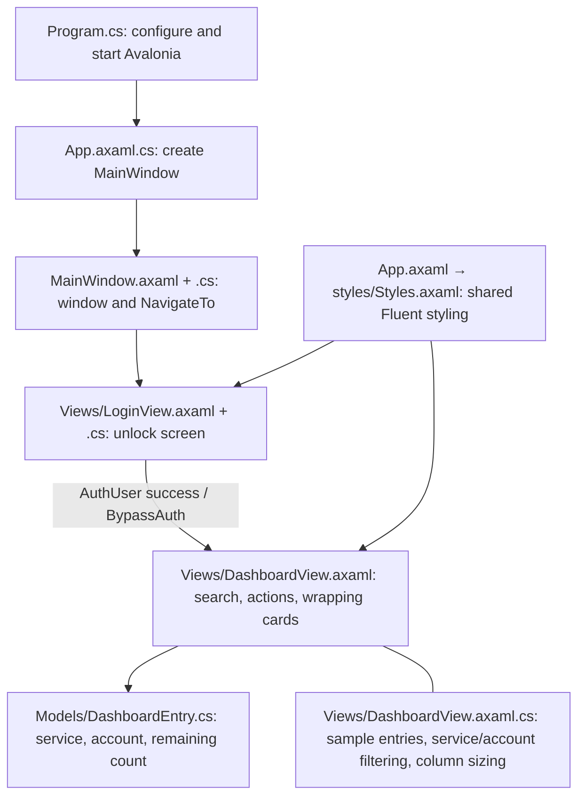

# Dashboard file map

This map was verified against the source. GrepAI was initialized locally, but
`grepai watch` could not build its index because Ollama was not running at
`localhost:11434`. The diagram below is not a GrepAI-generated call graph.



| File | Responsibility |
| --- | --- |
| `Views/DashboardView.axaml` | Scoped dark theme, search field, New entry button, Logout, card template, scrollable wrapping grid, empty search state. |
| `Views/DashboardView.axaml.cs` | Eight sample entries, service/account filtering, sizing complete columns to the viewport. |
| `Models/DashboardEntry.cs` | Card display data, singular/plural count labels, low-code and empty-code states. |
| `MainWindow.axaml` | Default 1177 × 702 window, minimum 360 × 450, view host. |
| `MainWindow.axaml.cs` | Starts on LoginView and replaces the current view through NavigateTo. |
| `Views/LoginView.axaml.cs` | Existing platform authentication helper and debug navigation. |
| `styles/Styles.axaml` | Shared control styles. Dashboard-specific styles live in DashboardView. |

## Preview behavior

The cards reproduce the supplied mockup and are sample data only. Each card shows a service, account label, and remaining-code count. Counts of
one or two show a low-code warning; zero shows no codes remaining. Search filters
both service names and account labels; clearing search restores all eight. Cards use up to four columns,
wrap at narrower sizes, and scroll vertically. New entry remains a visual placeholder, as it was before this UI
change. Entry creation, encryption, and persistence remain in `TODO.md`.

## GrepAI

Configuration is local in `.grepai/config.yaml`, excluded from Git. The generated
`bin`, `obj`, and `graphify-out` directories are excluded from indexing.
With Ollama installed and running, use:

```sh
ollama pull nomic-embed-text
grepai watch
# From a second terminal in this project:
grepai search "dashboard filtering and navigation"
grepai trace graph NavigateTo --depth 3 --json
```

GrepAI's C# call graph should be supplemented with the AXAML references above:
event wiring and templates are defined in markup.

## Documentation consulted through Context7

- [Avalonia responsive card layouts](https://github.com/avaloniaui/avalonia-docs/blob/main/docs/how-to/responsive-layout-how-to.md)
- [WrapPanel spacing](https://github.com/avaloniaui/avalonia-docs/blob/main/controls/layout/panels/wrappanel.md)
- [Compiled bindings](https://github.com/avaloniaui/avalonia-docs/blob/main/docs/data-binding/compiled-bindings.md)
- [GrepAI local embedding setup](https://yoanbernabeu.github.io/grepai/backends/embedders/)

## Validation

- `dotnet build --no-restore -p:UsedAvaloniaProducts=`: the empty property skips
  Avalonia's build telemetry, which otherwise tries to write outside this
  workspace sandbox. It does not change the application build settings.
- A temporary Avalonia.Headless 12.1.2 preview harness rendered the actual AXAML
  at 1177, 700, and 360 pixels wide. It checked eight initial cards, trimmed and
  case-insensitive service/account search, no-result feedback, clearing search, count labels and states.
- Headless rendering verifies layout and interaction logic; native window chrome
  and the platform authentication helper were not exercised.

## Card options menu

Each card has a bottom-right three-dot button using `Button.Flyout` and a native
`MenuFlyout`, with a vector pen icon for Edit and a trash icon for Delete. Delete removes the selected entry from the in-memory collection. Edit remains
a UI placeholder; persistence is not implemented.
The menu is keyboard accessible and uses standard flyout dismissal behavior.

## Entry details overlay

The entire card is a keyboard-accessible button. Its visual content is separate
from the three-dot button, so the options menu never triggers entry details.
The options flyout matches the card surface and opens above its button with an
eight-pixel gap, aligned to its right edge.

Clicking a card selects its `DashboardEntry` for a centered details panel showing
service, full account label, website, remaining-code status, and notes. The full
dashboard is dimmed and disabled until the panel closes. Close or Escape restores
focus to the originating card. The panel scrolls within small windows. Sample
entries contain no stored recovery codes.

Verified with Avalonia.Headless: real pointer activation, independent overflow
menus, correct selected entry, blocked background controls, initial focus, Tab
containment, close-button restoration, Escape, and 360 × 450 layout bounds.

## Proportional card sizing and opening motion

Each entry is designed at 220 × 200 inside a uniform `Viewbox`. The viewport
chooses one to four columns, sizing cards between 180 and 280 pixels wide while
keeping the original aspect ratio. The same transform scales text, padding,
status badges, and buttons; hit testing follows the scaled controls.

The details overlay fades in while its panel scales from 96% over 200 ms. The
options flyout fades and scales from 94% over 160 ms, anchored at the bottom-right
near the three-dot button. Both animations replay on opening. Closing details
removes the animation classes, so rapid close/reopen does not leave stale opacity.

Headless checks verified intermediate opacity, completed animations, reopening,
and equal text/card scale factors at window widths 1177, 1000, 700, and 360.

## Deleting entries

Delete removes the exact selected entry from the in-memory source and the
observable collection of filtered entries. Clearing search does not bring deleted
entries back. Removing the last entry shows “No entries yet.”

Before removal, the view captures each card’s rendered position, including any
slide already in progress. After layout closes the gap, temporary translation
offsets ease back to zero over 260 ms, so surviving cards slide into their new
positions across rows. Search results and scaled cards use the same layout.

Verified middle, last, filtered, rapid successive and final-entry deletion with
headless pointer interaction; verified horizontal/vertical slide offsets and
completion. Deletions last for this dashboard instance; there is no disk storage.
